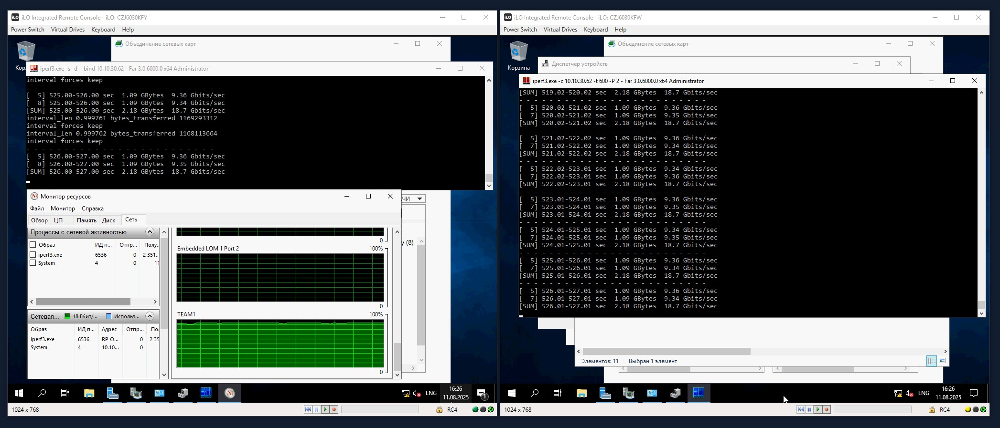
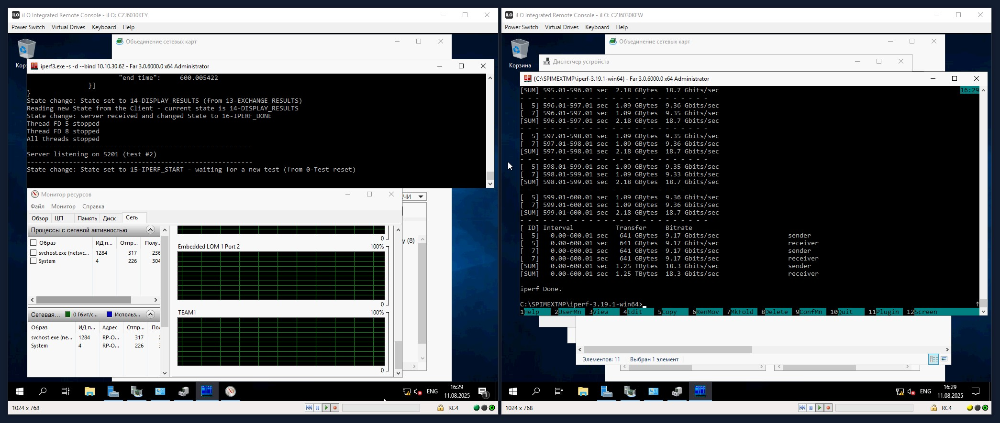
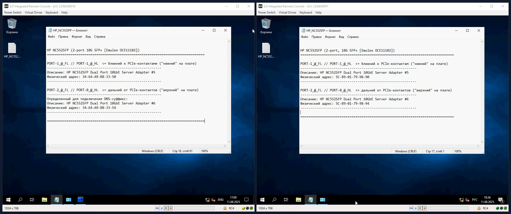

### Доктрина маркировки (оборудования и элементов СКС) в УТС ПБ

---
#### 1) Общие положения

1.1) В наклейках в основном используется шрифт CONSOLAS чтобы различать ```"букву O" и "цифру 0"```, ```"букву l" и "цифру 1"```, ```...```.

---
#### 2) Маркировка оборудования

2.1)  Размер наклеек 'имя устройства' и 'инвентарный номер' составляет **40 мм** в длину и **6 мм** в высоту (= '6x40').

2.2) Для наклеек 'имя устройства' используется **ЖЕЛТАЯ лента шириной 6 мм**.

2.3) Для наклеек 'инвентарный номер' используется **БЕЛАЯ лента шириной 6 мм**.

2.4) Маркировка имени и инвентарного номера производится с ОБЕИХ сторон устройства (спереди/front и
сзади/rear). Иногда спереди или сзади можно разместить по 2 наклейки по тем или иным причинам.
НАПРИМЕР [типовые случае двойных наклеек]:
- для СХД с 2-мя RAID-контроллерами делаем наклейки на обоих контроллерах (как ИУ, так и ИН);
- для коммутаторов с большим количеством портов делаем 2 наклейки с ИУ на переднюю часть (чтобы подключенные кабели не перекрывали наклейки с именем устройства); 

2.5) Маркировку имени и/или инвентарного номера допускается размещать как горизонтально, так и
вертикально - в зависимости от доступного для этого места на корпусе устройства. При выборе местополодения и ориентации наклейки на устройстве важно учитывать следующие факторы:
- стараться минимизировать перекрытие вентиляционных отверстий наклейкой;
- стараться размещать наклейки так, чтобы после размещения оборудования в стойке и подключения всех необходимых коммуникация наклейки оперативно считывались как спереди, так и сзади (без необходимости куда-то подлезать, что-то отгибать, раздвигать и пр.);
- соблюдать горизонталь и вертикаль - т.е. размещать наклейки либо строго горизонтально, либо строго вертикально;
- при размещении наклеек вертикально ориентировать направление текста "внутрь стойки"; 

2.6) Слово «multi» в имени макета означает, что целевой объект состоит из нескольких устройств. Например,
СХД состоит их 3-х полок, но была поставлена на учет как одно ОС - в этом случае 'инвентарный номер'
на всех полках будет одинаковый, но чтобы их как-то различать в наклейку c инвентарным номером
добавляется дополнительная цифра в формате подстрочного знака. При этом наклейки с именем и так
будут разными - с указанием логической роли полки справа от имени (HEAD, EXP1, EXP2, ...).
Есть универсальный макет наклейки имени одиночного целевого устройства, который подходит для
сервера, сетевых устройств (свичт, роутер, fw) и одинарных NAS-ов. Но для составных устройств
(например, СХД, состоящих из некольких полок), используется другой макет, где дополнительно
указывается логическая роль отдельного устройства в комплексе.

---
#### 3) Маркировка кабелей

3.1) Для маркировки патчкордов и кабелей РАНЕЕ использовалось 2 типа наклеек, которые размещались как
совместно (рядом на одном кабеле), так и раздельно/независимо – наклейка «ID» и наклейка «коммутация».

3.1.1) Шаблон наклейки «ID» [неактуально и более не используется]:
- Это вертикальный макет (для удобства считывания), состоящий из 3-х строк;
- Это уникальный 8-значный идентификатор конкретного патчкорда - по факту замена всяким
времянкам типа цветной изоленты и надписей маркером.
- ID назначается по дню монтажа потчкорда и формируется из даты (YYMMDD) и порядкового номера патчкорда в указанную дату (NN) - например,
2019-12-31 инженерами ОСА был произведен в DS, где было проложено в общей сложности 14
кабелей с номерами 01-14 и, соответственно, ID 19123101...19123114. Макет 'вертикальный' и
визуально разделен на 2 части для удобочитаемости - сверху YYMM и ниже DDNN.
- Идея наклейки: гарантированная идентификация кабелей в случае, если кабели использовались повторно с другим обрудованием или портами, но наклейки "коммутация" заменены при этом не были;
- Наклейки с ID готовятся заране (до поездки в ЦОД) и наносятся ДО его протяжки/укладки или на завершающей стадии в случае с одтиночным кабелем (когда точно ясна необходимая длина и его еще можно "продернуть руками" чтобы гарантированно идентифицировать). При протяжке по одному маршруту нескольких кабелей наклейки с ID наносятся на кабели строго до начала их протяжки.

3.1.2) Шаблон наклейки «коммутация» [АКТУАЛЬНО]:
- Это горизонтальный макет, состоящий из 2 строк (одна строка "SRC", другая "DST", или наоборот);
- Правый блок макета - это автоматическая зеркальная копия левого [основного в макете] блока;
- Идея наклейки - понятно обозначить те 2 порта, которые связывает кабель (изначально планировалость использовать не точные/дословные имена объектов, а их смысловую часть, минимально достаточную для понимания);
- Порядок указания объектов на наклейке значения не имеет;
- В именах сетевых устройств допускается не указывать центральную часть, только "блок локации" и "ролевой блок" {НАПРИМЕР: DS--MG01, LX--SV03(1)}
- В именах серверов и СХД рекомендуется использовать полное имя устройства, с указанием 'префикса локации'

---
#### 4) Концепция нумерации адаптеров/карт в устройствах
4.1) Общее правило: нумеруем карты "слева направо" и "сверху вниз" - мнемонически это соответствует условной букве 'Z' (при взгляде "сзади" на устройство [rear view]).
4.2) При этом принимаем следующие ограничения/допущения:
- в устройстве только один HBA-адаптер для SAN-сети;
- в устройстве может от 1 до 5 LAN-карт;
- блок LAN-портов, распаянных на материнской плате, считается отдельной "картой" с номером 0.

ПРИМЕРЫ:
- 1U сервер

- 2U сервер (тип-1)

- NAS


---
#### 5) Проблема нумерации портов в адаптерах/картах устройств
У каждого из портов карты с завода есть уникальный заводской идентификатор (MAC-address [MAC] для LAN-портов или PortWWN [PWWN] для SAN-портов). В рамках одной карты порты расположены в порядке возрастания/убывания значений MAC или PWWN. В хостовой ОС физическим портам карты номера в именах интерфейсов присваиваются в порядке возрастания их MAC/PWWN. При этом далеко не на всех картых есть какая-либо маркировка порядка расположения портов. Нет единого стандарта ни о направлении размещения портов на карте (например, порт с минимальным MAC/PWWN всегда расположен ближе всего к разъему PCIe карты - это может быть так, но и наоборот тоже встречается), ни о том, как нумеруются порты на карте ("0,1,2,.." или "1,2,3,.." или "А,B,C,.." или еще что-то).

---
